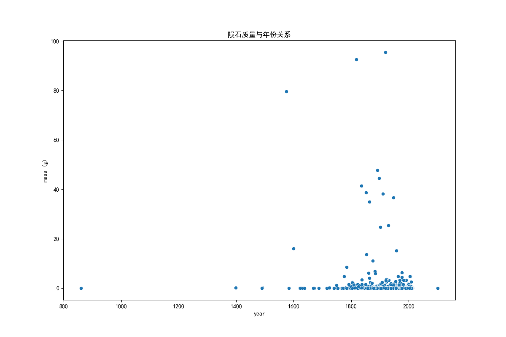
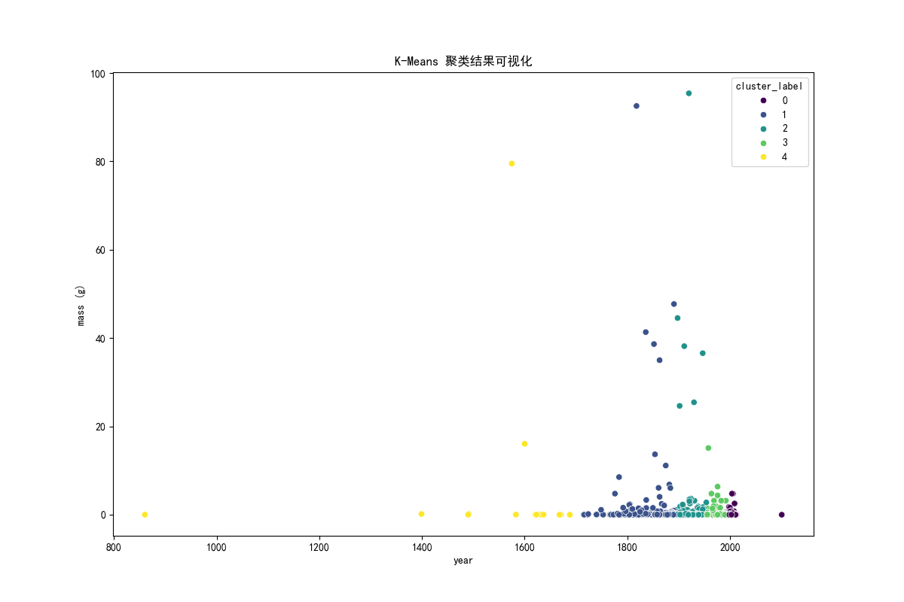
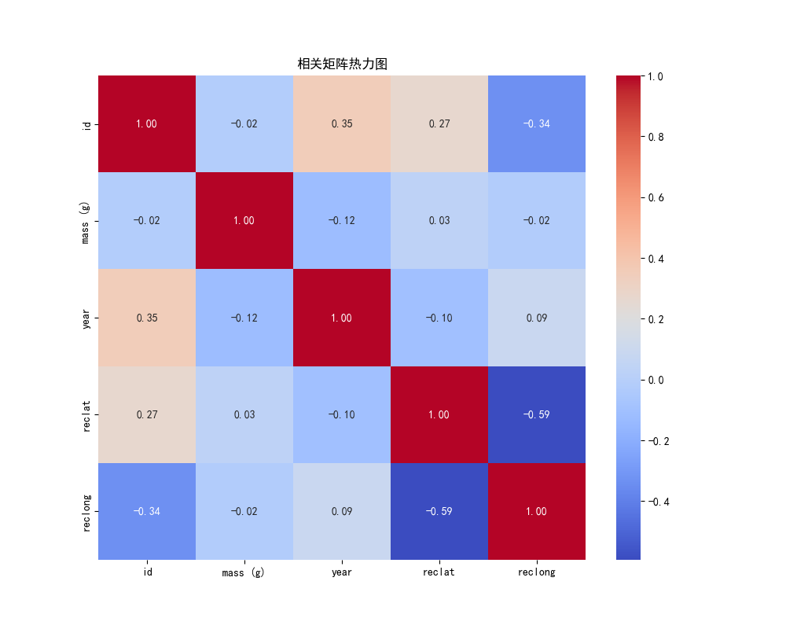
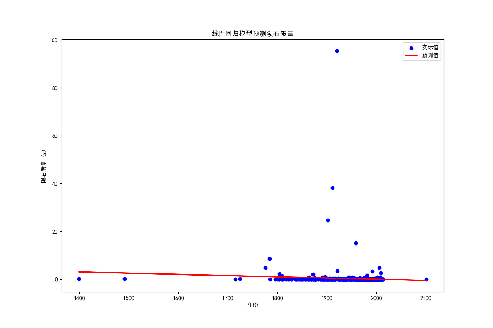

# 陨石落地数据分析项目

### 项目归属
#### 厦门中软国际 A区开发五 ChengYiHui 此代码开源，如需取用，请在2023/12/10后，谢谢。
## 项目概述
陨石落地数据分析项目旨在通过对 NASA 提供的陨石落地数据集进行深入分析，揭示陨石质量、年份与地理位置等属性之间的关系，以及通过聚类和建模方法洞察数据的潜在规律。通过此项目，我们将展示数据科学在探索天体事件方面的应用，从而更好地理解陨石落地事件的分布和特征。

## 数据集
- 数据集来源：[NASA's 开放数据平台](https://data.nasa.gov/Space-Science/Meteorite-Landings/gh4g-9sfh)
- 数据集名：`Meteorite_Landings.csv`
- 数据集文件路径(相对)：`templates/data/Meteorite_Landings.csv`

## 文件结构
- `data_processing.py`: 数据处理模块，包括加载、探索、清洗和标准化数据的功能。
- `data_kmeans.py`: 聚类模块，包含应用 K-Means 算法的功能。
- `modeling.py`: 建模模块，包含线性回归模型的训练和评估功能。
- `visualization.py`: 可视化模块，包含绘制散点图、相关性矩阵热力图和 K-Means 聚类结果可视化的功能。
- `main.py`: 主函数，整合数据处理、建模和可视化的流程。

## 使用说明

1. **文件目录：** 确保文件目录正确，以下是结构：
```
I:.
├─.idea
│  └─inspectionProfiles
├─templates
│  ├─data - 数据文件存放处
│  └─plt_imgs - 图片保存处
├─[data_kmeans.py] - k均值算法文件
├─[data_processing.py] - 数据处理文件
├─[main.py] - 主函数
├─[modeling.py] - 建模文件
├─[visualization.py] - 可视化文件 
└─[README.md] - 说明文档

```

2. **安装依赖：** 确保已安装所需的 Python 库，可以通过运行以下命令安装：

    ```bash
    pip install pandas seaborn matplotlib scikit-learn
    ```
   (可选)使用清华园pip镜像安装:
    ```bash
    pip install -i https://pypi.tuna.tsinghua.edu.cn/simple pandas seaborn matplotlib scikit-learn
    ```

3. **运行主程序：** 在终端中运行以下命令启动主程序：

    ```bash
    python main.py
    ```

4. **结果查看：** 程序将加载数据，进行数据处理、建模和可视化，最终展示陨石质量与年份关系散点图、相关性矩阵热力图和 K-Means 聚类结果可视化。

## 项目详细步骤和说明
### 1. 数据加载和探索
- 运行 `main.py` 中的 `load_and_explore_data` 函数，该函数将加载 CSV 文件并展示前10行数据，数据信息，形状，以及描述统计信息。
  ```python
  # main.py
  
  # 加载和探索数据
  meteorite_df = load_and_explore_data(file_path)
  ```

### 2. 数据清洗
- 运行 `main.py` 中的 `clean_data` 函数，该函数将删除包含缺失值的行。
  ```python
  # main.py

  # 数据清洗
  meteorite_df = clean_data(meteorite_df)
  ```

### 3. 数据标准化
- 运行 `main.py` 中的 `standardize_data` 函数，该函数将使用 `StandardScaler` 对 'mass (g)' 列进行标准化。
  ```python
  # main.py

  # 数据标准化
  meteorite_df = standardize_data(meteorite_df)
  ```

### **(新增)**  在数据标准化下，创建算法模型对象，并进行算法模型训练，接下去完成模型性能评估（分数评估，报告评估）
- 在 `data_processing.py` 中添加数据标准化后的功能
- ```python
  def standardize_and_train_model(df):
      ...
  ```
  
- 在 `modeling.py` 中添加数据标准化后的功能
- ```python
  from sklearn.metrics import r2_score, mean_absolute_error

  def evaluate_model_performance(model, X_test, y_test):
      ...
  ```

- 在 `main.py` 中添加数据标准化后的功能
- ```python
  if __name__ == "__main__":
    file_path = 'templates/data/Meteorite_Landings.csv'

    # 加载和探索数据
    meteorite_df = load_and_explore_data(file_path)

    # 数据清洗
    meteorite_df = clean_data(meteorite_df)

    # 数据标准化并训练模型
    model, X_test, y_test = standardize_and_train_model(meteorite_df)

    # 评估模型性能
    evaluate_model_performance(model, X_test, y_test)

    # 其他功能...
  ```


### 4. 陨石质量与年份关系可视化
- 运行 `main.py` 中的 `visualize_mass_vs_year` 函数，该函数将展示陨石质量与年份关系的散点图。
  ```python
  # main.py

  # 可视化陨石质量与年份关系，并保存图表
  visualize_mass_vs_year(meteorite_df, save_path='visualization.png')
  ```
  


### 5. K-Means 聚类结果可视化
- 运行 `main.py` 中的 `visualize_kmeans_clusters` 函数，该函数将展示 K-Means 聚类结果的散点图。
  ```python
  # main.py

  # 聚类结果可视化
  visualize_kmeans_clusters(meteorite_df, save_path='templates/plt_imgs/visualize_kmeans_clusters.png')
  ```
  

### 6. 相关性矩阵热力图
- 运行 `main.py` 中的 `visualize_correlation_heatmap` 函数，该函数将计算相关性矩阵并绘制热力图。
  ```python
  # main.py

  # 相关性矩阵热力图
  visualize_correlation_heatmap(meteorite_df, save_path='templates/plt_imgs/visualize_correlation_heatmap.png')
  ```
  

### 7. 模型训练和评估
- 运行 `main.py` 中的 `train_and_evaluate_model` 函数，该函数将使用线性回归模型进行陨石质量预测，并展示预测结果及均方误差。
  ```python
  # main.py

  # 模型训练和评估
  train_and_evaluate_model(meteorite_df, save_path='templates/plt_imgs/train_and_evaluate_model.png')
  ```
  

### 8. 结论和进一步分析
- 根据以上步骤的结果，得出结论并进行进一步分析，考虑模型的有效性和可解释性。

## 注意事项
- 本项目假设数据集文件为 `Meteorite_Landings.csv`，请确保文件在项目根目录中。
- 为了避免 FutureWarning，代码中显式设置了 K-Means 的 `n_init` 参数。
- 项目中使用的数据探索和处理方法可能需要根据实际数据的特点进行调整和优化。

## 项目分析方法规划
### 一、行业背景知识
1. **了解背景知识：** 学习有关天体事件的背景知识，包括陨石落地的一般过程和影响。
2. **掌握行业专业术语：** 理解并熟悉与天体事件相关的专业术语。
3. **对历史数据文件进行初步探索分析：** 在项目开始阶段，对历史数据文件进行初步的探索性数据分析。

### 二、领域标准分析模型
4. **了解天体事件领域相关分析模型：** 研究并了解天体事件领域常用的分析模型，确保了解目前在该领域中通用的数据分析方法。
5. **探索陨石落地事件的特殊属性：** 分析数据集中陨石落地事件的特殊属性，以便更好地选择适用的分析方法。

### 三、科学计算与数据分析
6. **抽取数据：** 从数据集中抽取关键信息，为后续分析做准备。
7. **数据探索分析：** 利用科学计算工具和数据分析技术，对数据进行探索性分析，了解数据的分布、特征等。
8. **数据预处理：**
   - 8.1 **数据清洗：** 删除或处理缺失值，确保数据的完整性。
   - 8.2 **属性规约：** 如有需要，对数据进行属性规约，选择关键特征。
   - 8.3 **数据变换：** 对数据进行标准化等变换，以确保模型的准确性。

### 四、聚类与建模
9. **利用 K-Means 算法进行聚类分析：** 探索陨石落地事件的聚类结果，尝试发现数据中的潜在模式。
10. **构建线性回归模型：** 使用线性回归模型预测陨石质量，并进行模型评估。
11. **分析聚类与建模结果：** 综合聚类和建模结果，得出结论并解释模型的有效性。

### 五、根据结论得出最终结果
12. **可视化陨石质量与年份关系：** 利用可视化手段展示陨石质量与年份的关系，以便更直观地理解数据。
13. **分析聚类结果，制定相应的结论：** 对 K-Means 聚类结果进行分析，根据不同聚类的特点制定相应的结论。


